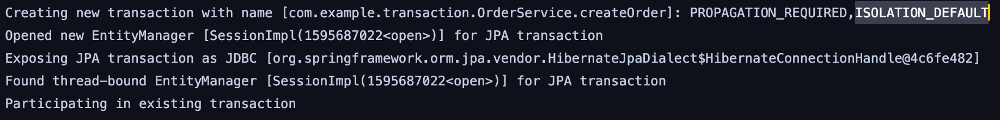
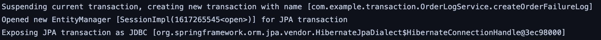

# Transaction 분리에 대하여

회사에 진행 중인 이커머스 신규 구축 프로젝트를 진행하면서 고민이 하나 생겨서 정리해봅니다.   
관리자 페이지 주문관리 기능을 개발하고 있습니다.   

주문 취소/ 부분취소 기능을 개발 실제 결제한 금액보다 더 큰 금액을 PG에 취소요청을 하게되면
취소 실패 응답을 받게됩니다.

주문 취소 로직 중 실패 응답을 받게되면 Exception을 터트려 취소 트랜잭션을 Roll-Back하게 되며
이 과정에서 응답으로 받은 불가 사유를 저장하고 있었는데 실제 확인 해보면 실패시 로그가 저장되지 않았습니다.

RollBack이 되는 과정에서 불가 사유를 저장하는 트랜잭션이 한 트랜잭션 내에서 실행되고 있어 같이 RollBack이 되고 있었습니다.

로그가 저장되지 않는 것을 보고 기존에 알고 있었으나 놓친 부분이라는 것을 인지하고 
실패 로그를 저장하는 트랜잭션을 분리하였고, 공유합니다.

예제 소스는 주문을 하는 과정에서 PG 결제 실패를 예시로 만들었습니다. (간단하게)

- Test Code
  - OrderServiceTest.rollbackTest()

### Transaction 분리
PG 요청 중 Exception이 발생하면 OrderLogService.createOrderFailureLog()가 실행되며,
`@Transactional(propagation = Propagation.REQUIRES_NEW)` 옵션을 줘서 새로운 Transaction을 만들게 됩니다.

OrderService.createOrder Transaction

new Transaction OrderLogService.createOrderFailureLog()

